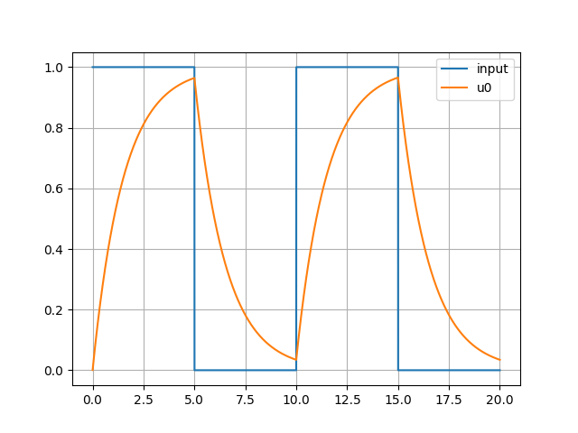

# tosys
A toy rk4 ODE solver, inspired by State-space equation. 🍭  
基于状态空间方程和四阶龙格-库塔的微分方程数值解法。需要手动构造微分方程（组）。  

## InputSignal  
输入信号已包含：  
- `constant`: 常数信号`f(t) = 1`
- `sin`: 正弦信号`f(t) = A*sin(omega*t+phi)`
- `dirac`: 单位冲激函数`f(t) = delta(t)`
- `delay`: 延时函数`f(t) = g(t-t0)`
- `diff`:  微分函数`f(t) = g'(t)`
- `int`: 积分函数` f(t) = H(t)`
- `squre`: 方波信号


## Example  

```Python
from tosys import State, System, InputSignal
"""
模拟电容充放电的过程    
"""

R = 15  # Ohm
L = 0.1  # H
C = 0.1  # F
ui = 1    # v

square = InputSignal.squre(5)  # 输入方波信号
sys = System(0, 20, .001, input=lambda t: square(t))  # 建立系统

"""
状态方程的形式：
    u0' = ui - u0/R/C  
方程右边对应的代码：
    lambda t, state: (ui*sys.input(t)-state['u0'])/R/C)
"""
sys.addState(State("u0", 0, lambda t, state: (ui*sys.input(t)-state['u0'])/R/C))

sys.RK4()  # 求解
sys.draw() # 画图
```  

  


因为代码中使用了大量的循环语句，所以效率不算太高。但是计算能力还算强大：可以求常见的微分方程（组）的解，也可用于计算控制系统各状态变量的时域变化情况。  

-----  
后面可能会再完善，目前要继续啃编译原理了。   
📅2022-06-21